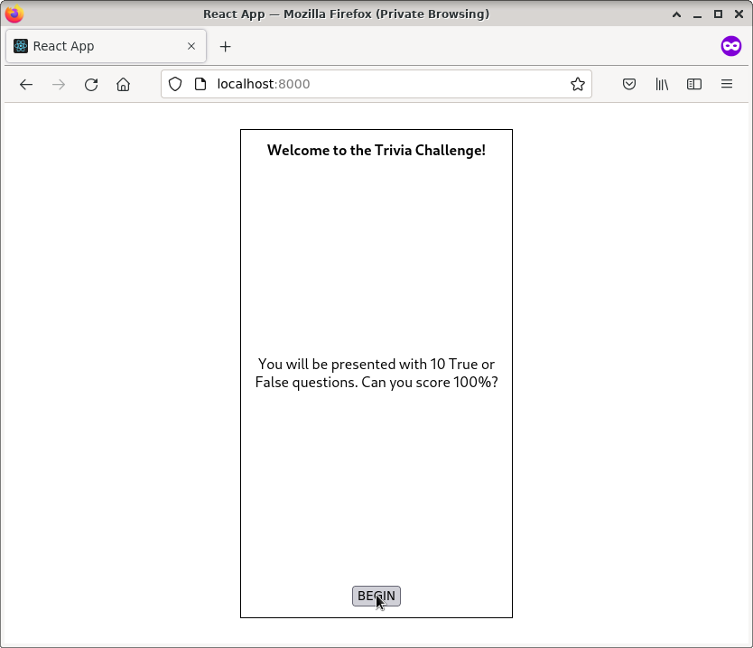

# TRIVIA GAME



## DEMONSTRATION VIDEO

[DEMONSTRATION VIDEO](https://youtu.be/USsjX2rGHtE)

## ABOUT THIS PROJECT

This project is about implementing a simple game of trivia, where the answer is either true or false. The questions are retrieved from an online server using an API and presented to the user. After all of the questions are answered, the score is presented to the user.

## HOW TO BUILD AND RUN

In order to build this, all the required packages must be installed first. This project uses [yarn](https://yarnpkg.com/), but if you have [npm](https://www.npmjs.com/) installed on your computer, the following command should be enough for installing all packages:

```
npm install
```

After all packages are installed, you can trigger the build process by running the following command (which uses yarn internally):

```
npm run build
```

If this command is run successfully, it will create a ```build/``` folder, where all the static HTML files are to be served. You'll need to set up an HTTP server to serve files from that folder. If you have [Python3](https://www.python.org/download/releases/3.0/) installed on your computer, the following two commands will likely be enough for this:

```
cd build/
python3 -m http.server
```

That will start a server on [localhost, port 8000](http://localhost:8000). From there, you'll be able to play the trivia game if you're connected to the Internet.